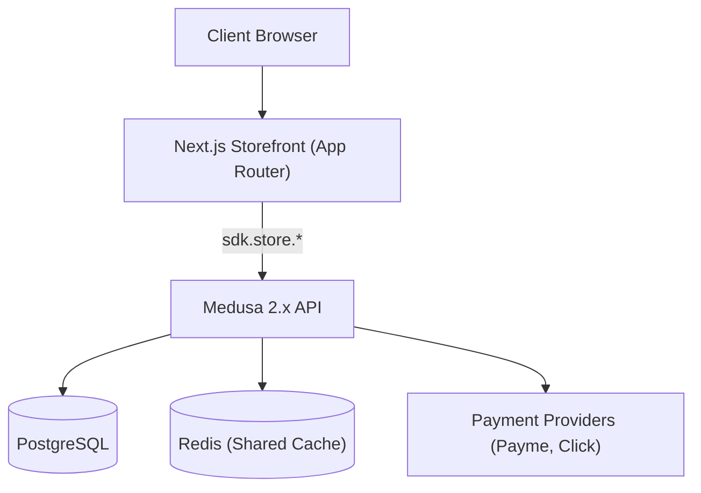

# System Architecture

This document describes the production-ready architecture of the Toolbox storefront and backend, focusing on data consistency, payment security, and the BTS-only delivery model.

## 1. High-Level Architecture

The system is built on a distributed Medusa 2.x backend and a Next.js App Router storefront, optimized for performance and reliability.

- **Backend**: Medusa 2.x, running as a Node.js service.
- **Storefront**: Next.js App Router using React Server Components (RSC) for data fetching.
- **Primary Database**: PostgreSQL for relational data storage.
- **Infrastructure**:
    - **Shared Cache**: Redis (`@medusajs/cache-redis`) is the SINGLE source of truth for caching across all backend instances.
    - **In-Memory Cache**: STRICTLY DISABLED in production to prevent data inconsistency (split-brain).

---

## 2. Product Data Architecture

Product data follows a strict schema to ensure reliable hydration, type safety, and SEO performance.

### Structured Metadata
The `metadata` JSONB field is governed by a strict contract (Zod Schema) and must include:
- `brand` (String)
- `category` (String)
- `professional_level` (String: "Hobby" | "Pro" | "Industrial")
- `pickup_only` (Boolean)
- `short_description` (String)
- `features` (Array<String>)
- `use_cases` (Array<String>)
- `specifications` (Record<String, String>)
- `seo_title`, `seo_description`, `seo_keywords` (Strings)

### Implementation Contracts
- **Schema Validation**: The storefront uses a Zod-based parser (`parseProductMetadata`) to enforce this schema at runtime. It provides safe defaults to prevent UI crashes.
- **Admin Management**: Managed via a custom Admin JSON Widget to ensure data integrity during entry.
- **SEO Integration**: The `generateMetadata` function utilizes this structured data with a fallback chain to ensure every page has valid meta tags.
- **PLP/PDP Contracts**: All product lists and detail pages are guaranteed to receive this structured data, enabled by the Redis Cache.

---

## 3. Caching Strategy

The system utilizes a multi-layered caching strategy where Redis is the critical backbone.

### Backend Redis Cache (`Modules.CACHE`)
- **Implementation**: Uses `@medusajs/cache-redis`.
- **Scope**: Caches Product metadata, Store API responses, OTP tokens, workflows, and job queues.
- **Criticality**: **MANDATORY**. Disabling Redis or falling back to in-memory cache is forbidden as it leads to non-deterministic behavior (partial metadata loads).
- **Risk Mitigation**: The "partial metadata" bug is permanently resolved by ensuring all backend instances read from this single Redis source.

### Next.js Data Cache
- **Mechanism**: React Server Components use `next.revalidate` and tags (`products`, `cart`).
- **Invalidation**: Triggered by backend webhooks or Admin actions via tag-based revalidation.

---

## 4. Checkout & Payment Architecture

The system enforces a **Backend-Driven Order Creation** pattern for security and consistency.

### Unified Payment Flow (Click & Payme)
Both providers follow an identical, secure workflow:
1.  **Frontend**:
    - Initializes payment session.
    - Redirects user to provider or polls for status.
    - **NEVER** calls `placeOrder` to create the order.
2.  **Backend**:
    - Receives `Perform/Complete` callback from the provider.
    - Validates signature and amount.
    - Retrieves `cart_id` from the secure session data (`payment_session.data`).
    - Executes `completeCartWorkflow` to create the order.
    - Idempotency is handled on the server to prevent duplicate orders during network retries.

**Key Rule**: The Backend is the **Single Source of Truth** for order creation.

---

## 5. Delivery & Fulfillment Model (BTS Postpaid)

The system operates on a specific "Goods Online, Delivery Offline" model.

### Business Rules
- **Online Payment**: Covers **PRODUCT COST ONLY**.
- **Delivery Payment**: Paid by the customer **separately upon receipt** (to the courier or at the BTS point).
- **Shipping Cost**:
    - Calculated approximately based on weight for informational purposes.
    - **EXCLUDED** from the total amount sent to the payment gateway (Payme/Click).
- **Address Handling**: Shipping addresses are collected solely for routing and logistics; they do not affect the online transaction total.

---

## 6. Observability & Stability

To ensure production stability, the system implements:

- **Logging**:
    - Structured logs for all Payment Callbacks (payloads, signatures, outcomes).
    - Logs for Cart Completion workflows (`completeCartWorkflow`).
    - warnings for Product Fetch consistency issues.
- **Scalability**:
    - Redis is required for horizontal scaling of backend instances.

---

## 7. Invariants & Guardrails

The following architectural rules are mandatory:

- **Redis Cache**: Must be active. `in-memory` cache is PROHIBITED.
- **+metadata**: All SDK queries must explicitly request `+metadata`.
- **Backend Checkout**: Frontend `placeOrder` is BANNED for production payment providers.
- **Shipping Totals**: Online payment total == `cart.subtotal` (minus discounts/gift cards). Shipping cost is NEVER included.

---

## 8. Architecture Status

- **Status**: Production-ready
- **Cache**: Redis-backed (shared)
- **Payments**: Backend-driven, idempotent
- **Product Data**: Structured & validated
- **Known Critical Risks**: Addressed (Metadata inconsistency resolved via Redis)
